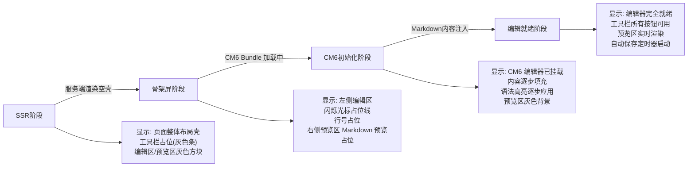
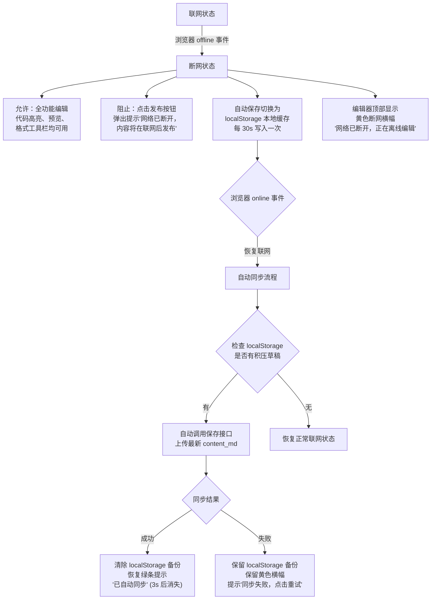

# 个人博客网站 — 产品需求文档（PRD）

---

| 文档信息 | |
|---------|---|
| 产品名称 | QzBlog（暂定） |
| 版本 | v1.0 |
| 创建日期 | 2026-05-10 |
| 作者 | 产品经理 |
| 状态 | 已定稿，可进入开发 |

---

## 1. 产品概述

### 1.1 产品定位

面向软件开发者的个人品牌站点，兼具技术博客写作、碎片化动态分享、个人履历展示与学习路径沉淀四大核心能力。产品以「写作即思考，分享即成长」为核心理念，帮助开发者在公开领域建立技术影响力。

### 1.2 产品目标

- 让博主高效产出高质量技术文章，降低写作与发布摩擦
- 为读者提供流畅的阅读体验，尤其是代码浏览与系列文章连续阅读
- 立体展示博主的技能图谱、项目经验与成长轨迹
- 通过评论、点赞等轻互动形成读者社区氛围

---

## 2. 目标用户

### 2.1 博主（内容生产者）

- 在职软件开发者，有技术沉淀与分享意愿
- 需要个人品牌阵地，不满足于第三方平台的限制
- 习惯 Markdown 写作，代码演示是刚需

### 2.2 读者（内容消费者）

- 同领域开发者，通过搜索引擎或友链进入
- 核心诉求：快速获取技术信息，阅读代码示例
- 部分读者有持续关注意愿（RSS / 邮件 / 收藏）

---

## 3. 功能总览

| 模块 | 功能 | 优先级 |
|------|------|--------|
| 文章系统 | 文章发布与编辑、Markdown 渲染、代码高亮与复制、文章目录（TOC）、系列文章/专栏、草稿与定时发布 | P0 |
| 动态发布 | 短文本动态发布、时间线展示 | P0 |
| 个人介绍 | 头像、技能栈、社交链接、个人简介 | P0 |
| 学习路线 | 路线节点管理、与文章关联、进度展示 | P1 |
| 项目展示 | 项目卡片、技术栈标签、源码/演示链接 | P1 |
| 时间线 | 职业与技术成长关键节点展示 | P1 |
| 评论系统 | 文章评论、嵌套回复、评论通知 | P1 |
| 互动 | 文章点赞、文章收藏 | P1 |
| 全站搜索 | 文章与动态全文检索 | P1 |
| 暗色模式 | 亮色/暗色主题切换，跟随系统 | P1 |
| 数据统计 | 文章阅读量、访问趋势（仅博主可见） | P2 |

---

## 4. 详细功能需求

### 4.1 文章发布系统

#### 4.1.1 文章编辑器

**功能描述：** 提供 Markdown 在线编辑器作为文章创作的主入口，支持实时预览、分栏编辑、草稿自动保存，是博主撰写与发布文章的核心工具。

**需求详情：**

- 采用 CodeMirror 6 作为 Markdown 编辑引擎，提供语法高亮、自动补全、快捷键等专业编辑体验
- 分栏布局（左编辑 / 右预览），支持拖拽调整分栏比例
- 工具栏快捷插入：加粗、斜体、链接、图片、代码块、表格、LaTeX 公式、Mermaid 图表
- 支持拖拽或粘贴上传图片，自动存储至服务器并生成引用链接
- 快捷键体系：Ctrl+S 保存草稿、Ctrl+Shift+P 发布、Ctrl+B 加粗、Ctrl+I 斜体、Ctrl+K 插入链接
- 每 30 秒自动保存草稿至后端，防止意外丢失
- 编辑器支持暗色/亮色主题，跟随系统或手动切换
- 移动端仅展示编辑区或预览区，通过 Tab 切换

#### 4.1.2 Markdown 渲染

**功能描述：** 文章详情页对 Markdown 内容进行高保真渲染。

**需求详情：**

- 支持 GFM（GitHub Flavored Markdown）语法全集，包括表格、任务列表、删除线、脚注等
- 支持 LaTeX 数学公式渲染（行内公式 `$...$` 与块级公式 `$$...$$`）
- 支持 Mermaid 图表渲染（流程图、时序图、甘特图等）
- 支持图片点击放大查看
- 移动端排版适配，表格横向滚动

#### 4.1.3 代码高亮与复制

**功能描述：** 代码块支持语法高亮与一键复制。

**需求详情：**

- 根据语言标识（如 `python`、`javascript`、`go`）自动应用对应语法高亮主题
- 支持至少 20 种以上常见编程语言高亮
- 代码块右上角显示「复制」按钮，点击后复制全部代码并提示「已复制」
- 代码块显示行号
- 支持代码块横向滚动（长代码行不换行）

**交互示意：**

```
┌─────────────────────────────────────────────┐
│  python                         [📋 复制]   │
│ ─────────────────────────────────────────── │
│  1  def fibonacci(n):                       │
│  2      if n <= 1:                          │
│  3          return n                        │
│  4      return fibonacci(n-1) + ...         │
└─────────────────────────────────────────────┘
```

#### 4.1.4 文章目录（TOC）

**功能描述：** 根据文章内 Markdown 标题自动生成层级目录。

**需求详情：**

- 解析 H1~H4 标题，自动生成树形目录结构
- 桌面端目录固定在文章左侧或右侧，随页面滚动高亮当前阅读位置
- 移动端目录收折为悬浮按钮，点击展开抽屉
- 点击目录项平滑滚动至对应标题位置
- 支持「目录」标题下可配置是否显示

#### 4.1.5 系列文章 / 专栏

**功能描述：** 将多篇文章归入同一系列，形成有顺序的阅读路径。

**需求详情：**

- 创建系列时填写：系列名称、系列简介、封面图（可选）
- 文章编辑器内可选择将文章加入已有系列，并设定序号
- 文章详情页顶部/底部显示系列导航条，展示「上一篇 / 下一篇」链接
- 系列独立页面展示该系列所有文章列表及阅读进度
- 支持将系列置顶至文章列表页

**系列导航示意：**

```
┌──────────────────────────────────────────────────────────┐
│  📂 深入理解 Go 并发 — 第 3 篇 / 共 8 篇                  │
│  ← Goroutine 调度原理      │       Channel 底层实现 →     │
└──────────────────────────────────────────────────────────┘
```

#### 4.1.6 草稿与定时发布

**功能描述：** 文章可保存为草稿不对外可见，支持设定发布时间自动上线。

**需求详情：**

- 文章状态分为三类：草稿（仅博主可见）、已发布（公开）、定时发布（待自动发布）
- 草稿列表独立于已发布文章，在管理后台可见
- 定时发布：设定具体日期时间（精确到分钟），到达后自动将文章状态切换为「已发布」
- 定时发布前 5 分钟可取消或修改时间
- 定时发布失败时（如服务异常），文章保持草稿状态并向博主发送通知

#### 4.1.7 文章列表与展示

**需求详情：**

- 首页文章列表支持卡片式或列表式布局（博主可配置）
- 每篇文章卡片展示：标题、发布日期、标签、摘要、阅读量
- 支持按标签筛选文章
- 列表分页加载（无限滚动或传统分页）

---

### 4.2 动态发布

#### 4.2.1 动态发布与管理

**功能描述：** 轻量级短内容发布模块，类似「说说」或「微动态」，用于随手记录想法、分享进展或碎碎念。

**需求详情：**

- 动态输入框支持纯文本，字数上限 500 字
- 支持插入单个链接（自动识别并渲染为可点击链接）
- 支持插入单张图片
- 动态发布后即时展示在动态时间线中
- 博主可删除自己的动态
- 动态列表按时间倒序排列，支持分页加载

#### 4.2.2 动态展示

**需求详情：**

- 动态以时间线形式展示，每条动态显示：头像、发布时间（相对时间如「3 小时前」）、内容
- 区分于文章列表，使用更轻量的视觉样式（如左边框竖线时间轴）
- 每条动态可被点赞
- 访问者可在动态区快速浏览，无需进入详情页

---

### 4.3 个人介绍

#### 4.3.1 个人主页

**功能描述：** 博主个人信息聚合页，是读者了解博主的第一入口。

**需求详情：**

- **头像区域：** 圆形头像 + 昵称 + 一句话简介（如「全栈开发者 / 开源爱好者」）
- **个人简介：** 自由文本区，支持 Markdown 或富文本，用于撰写详细的自我介绍
- **技能栈：** 以标签形式展示技术技能（如 `Go`、`React`、`Kubernetes`），每个标签可用颜色或图标区分
- **社交链接：** 图标式展示 GitHub、Twitter/X、掘金、LinkedIn 等链接，点击新窗口打开
- **统计数据展示：** 文章数、动态数、项目数、总字数
- **工作经历（可选）：** 公司名称、职位、时间段，以简洁列表展示
- 所有内容博主可在管理后台编辑

---

### 4.4 学习路线

#### 4.4.1 路线管理

**功能描述：** 结构化展示学习路径，将零散文章组织成系统化学习体系。

**需求详情：**

- 支持创建多条学习路线（如「Go 后端进阶」「系统设计入门」「前端工程化」）
- 每条路线包含：路线名称、路线简介、封面图（可选）、学习目标
- 路线内包含多个节点，每个节点包含：节点标题、简要说明、状态（学习中 / 已完成 / 计划中）、关联文章（可选）
- 节点支持拖拽排序与调整层级

#### 4.4.2 路线展示

**需求详情：**

- 学习路线以时间轴或路线图形式可视化展示
- 已完成节点用完成色标识，当前学习节点高亮
- 节点关联文章可直接点击跳转阅读
- 路线页面顶部展示整体进度百分比
- 支持查看者切换不同路线

---

### 4.5 项目展示（Portfolio）

#### 4.5.1 项目管理

**功能描述：** 以卡片形式展示博主的开源项目或个人作品。

**需求详情：**

- 项目信息包含：项目名称、项目简介、技术栈标签、项目截图/Logo、GitHub 链接、在线演示链接（可选）、Star 数（可选，手动填写或自动拉取）
- 支持排序（拖拽或手动设置顺序）
- 支持将重点项目置顶或标记为「Featured」

#### 4.5.2 项目展示

**需求详情：**

- 以卡片网格布局展示项目，每行 2-3 个项目卡片
- 卡片悬停效果：微放大 + 阴影加深
- 点击卡片跳转至项目详情或外部链接
- 技术栈标签以不同颜色区分

---

### 4.6 时间线 / 里程碑

**功能描述：** 以时间轴形式展示博主的职业与技术成长关键节点。

**需求详情：**

- 支持添加里程碑节点，包含：时间（年份或具体日期）、事件标题、详细描述（可选）、事件类型（工作 / 学习 / 开源贡献 / 演讲等）
- 时间轴以中轴线展开，左右交替布局（桌面端），移动端统一左侧布局
- 支持按事件类型筛选
- 点击节点可展开详情

---

### 4.7 评论系统

#### 4.7.1 评论发表

**功能描述：** 读者可在文章底部发表评论。

**需求详情：**

- 评论输入框支持 Markdown 基础语法（加粗、代码块、链接）
- 评论者需填写昵称和邮箱（邮箱不公开，用于 Gravatar 头像）
- 支持 Gravatar 头像自动展示
- 发表评论后即时显示在评论列表
- 评论提交采用频率限制（同 IP 每分钟不超过 3 条）
- 反垃圾评论策略（验证码、敏感词过滤）延至 v1.2 实现
- v1.0 兜底方案：所有评论默认需博主在管理后台手动审核后方可公开展示（pending → approved），博主可直接从审核队列通过或拒绝

#### 4.7.2 嵌套回复

**功能描述：** 支持对评论进行回复，形成讨论线索。

**需求详情：**

- 支持对评论进行回复，最多嵌套 2 层（评论 → 回复 → 再回复），保持可读性
- 回复时展示「回复 @昵称」，明确回复对象
- 被回复的原始内容折叠显示，可展开查看上下文
- 博主可置顶某条评论、删除不当评论

#### 4.7.3 评论通知

**需求详情：**

- 当有新评论时，博主在管理后台看到未读标记
- 博主回复读者评论后，读者通过邮件收到通知（可选配置）

---

### 4.8 点赞与收藏

#### 4.8.1 文章点赞

**功能描述：** 读者可对文章表达认可。

**需求详情：**

- 文章详情页底部显示点赞按钮 + 点赞数
- 点击点赞按钮触发动画效果
- 同一 IP/用户每天对同一文章仅可点赞一次（前端 + 后端双重限制）
- 博主可在统计面板查看每篇文章的点赞数趋势

#### 4.8.2 文章收藏

**功能描述：** 读者可收藏文章以供后续阅读。

**需求详情：**

- 文章详情页提供「收藏」按钮
- 收藏数据通过浏览器本地存储（localStorage），跨设备不同步（v1.0 简化方案）
- 提供独立的「我的收藏」页面，列出所有已收藏文章
- 可取消收藏

---

### 4.9 全站搜索

**功能描述：** 支持对文章标题、正文内容及动态进行关键词搜索，基于 PostgreSQL 全文检索（tsvector + pg_trgm）实现服务端搜索。

**需求详情：**

- 导航栏常驻搜索入口（搜索图标 + 快捷键 `/`）
- 输入关键词后实时展示搜索建议（文章标题模糊匹配，pg_trgm 相似度）
- 回车或点击搜索进入搜索结果页，由 PostgreSQL `ts_rank` 计算相关度排序
- 搜索结果每项显示：文章标题、摘要高亮关键词、发布日期、标签
- 搜索结果分页展示，响应时间 ≤ 500ms
- 无结果时展示推荐热门文章
- 索引更新：文章发布/更新时，PostgreSQL 触发器或应用层同步更新 tsvector 列

**搜索框展开状态示意：**

```
┌─────────────────────────────────────────┐
│  🔍  Go 并发                              │
│ ─────────────────────────────────────── │
│  📄 深入理解 Go 并发 — Goroutine 调度      │
│     Go 并发 · 2026-03-15                   │
│ ─────────────────────────────────────── │
│  📄 Go Channel 最佳实践                   │
│     Go 并发 · 2026-01-20                   │
└─────────────────────────────────────────┘
```

---

### 4.10 暗色模式

**功能描述：** 支持亮色与暗色主题切换，提升夜间阅读体验。

**需求详情：**

- 默认跟随系统主题偏好（prefers-color-scheme）
- 导航栏提供手动切换按钮（☀️ / 🌙 图标切换）
- 手动切换后覆盖系统偏好，且记住用户选择（localStorage 存储）
- 代码高亮主题跟随整体主题变化（亮色用 `github-light`，暗色用 `github-dark`）
- 文章正文、评论、导航等所有页面区域均完整适配暗色
- 切换过程平滑过渡，无闪烁

---

### 4.11 数据统计面板（仅博主可见）

**功能描述：** 为博主提供轻量级访问统计，了解博客运营状况。

**需求详情：**

- 访问需博主登录态验证，普通读者不可见
- **概览面板：** 总文章数、总访问量（PV / UV）、总点赞数、总评论数
- **文章排行：** 按阅读量降序展示文章列表，每项显示标题、阅读量、点赞数、评论数
- **访问趋势：** 以折线图展示近 7 天 / 30 天的 PV 与 UV 变化
- **访问来源：** 统计直接访问、搜索引擎、社交媒体、友链等来源占比（饼图）
- 统计数据记录不依赖第三方服务（如 Google Analytics），完全自建
- 数据保留周期：至少 12 个月

---

## 5. 非功能需求

### 5.1 性能要求

- 首页（文章列表）首次内容渲染（FCP）≤ 1.5 秒
- 文章详情页完全加载时间 ≤ 2 秒
- 图片支持懒加载，代码块按需语法高亮
- 全站搜索响应时间 ≤ 500ms

### 5.2 响应式设计

- 适配桌面端（≥1024px）、平板（768px-1023px）、手机端（<768px）
- 移动端导航栏收折为汉堡菜单
- 移动端文章目录收折为悬浮按钮
- 代码块在移动端横向滚动
- 管理后台仪表盘卡片在平板/手机端自适应为列表布局；编辑器在手机端提示「请在桌面端编辑」

### 5.3 可访问性

- 图片必须提供 alt 文本
- 语义化 HTML 标签
- 键盘导航支持（Tab 切换焦点、Enter 激活）
- 颜色对比度符合 WCAG AA 标准

### 5.4 SEO

- 采用 Next.js SSR + ISR 混合策略，确保搜索引擎可抓取全部页面
- 每个页面包含独立的 `<title>` 与 `<meta description>`
- 自动生成 sitemap.xml 与 robots.txt
- 文章结构化数据（JSON-LD Schema.org BlogPosting 格式）
- 支持 Open Graph 标签（分享至社交媒体时展示标题、摘要、封面图）
- 文章 slug 变更时旧 URL 通过 301 永久重定向至新地址

### 5.5 安全要求

**认证与授权：**
- 管理后台采用 NextAuth.js + GitHub OAuth 登录，JWT access_token（15min）+ refresh_token（7d）双 Token 轮换
- Next.js Middleware 统一拦截 `/admin/*` 和 `/api/admin/*` 路由，未认证请求重定向至登录页
- 不开放注册，管理员账号通过环境变量种子创建

**输入安全：**
- 评论提交 Markdown 渲染后经 rehype-sanitize 过滤，白名单语法：加粗、代码、链接，禁止标题/图片/表格/HTML 标签
- 在线编辑器预览区与发布渲染共用同一 sanitize 管线，防止预览阶段 XSS
- 社交链接输入校验：强制以 `https://` 开头，拒绝 `javascript:` 等危险协议
- 请求参数使用 ORM 参数化查询，杜绝 SQL 注入

**接口防护：**
- 评论/点赞 API 限流 10 次/min/IP；登录 API 限流 5 次/min/IP；全局 100 次/min/IP
- 全站 HTTPS 强制，Nginx/Caddy 层配置 HSTS 头
- CORS 白名单仅允许本站域名

**安全响应头：**
- Content-Security-Policy：限制 script-src、img-src 来源
- X-Frame-Options: DENY
- X-Content-Type-Options: nosniff
- Referrer-Policy: strict-origin-when-cross-origin

**文件上传：**
- 前端压缩 + 白名单格式校验（jpg/png/webp/gif），后端 magic number 校验
- 上传大小限制 ≤ 5MB，UUID 重命名存储
- 禁止 SVG 格式（XSS 风险）
- 存储路径按日期分片，防目录遍历

**基础设施安全：**
- PostgreSQL 端口仅 Docker 内部网络可访问，不暴露至公网
- 管理后台路径 `/admin` 建议在 Nginx 层增加 IP 白名单或 HTTP Basic Auth 双因子
- 定期 `npm audit` + Dependabot 自动依赖更新
- 环境变量管理：密钥和数据库连接串通过 Docker Compose `.env` 注入，禁止硬编码

### 5.6 异常状态与空状态设计

所有页面需覆盖以下三种异常态 UI，不得出现空白区域：

- **加载态（Skeleton）：** 文章列表、文章详情、搜索页、管理后台仪表盘均需骨架屏占位，渐变动画指示加载中
- **空状态（Empty State）：** 文章列表为空时展示「还没有文章，开始写第一篇吧」引导入口；搜索无结果时展示「未找到相关内容」+ 推荐热门文章；评论区为空时展示「暂无评论，来说点什么吧」
- **错误状态（Error State）：** 网络请求失败时展示错误提示 + 重试按钮；页面不存在（404）展示返回首页引导；服务端异常（500）展示致歉文案

### 5.7 快捷键体系

面向开发者的博客需提供键盘操作支持：

| 快捷键 | 作用域 | 功能 |
|--------|--------|------|
| `/` | 全站 | 聚焦搜索框 |
| `?` | 全站 | 显示快捷键帮助弹窗 |
| `t` | 全站 | 切换亮色/暗色主题 |
| `Ctrl+S` | 编辑器 | 保存草稿 |
| `Ctrl+Shift+P` | 编辑器 | 发布文章 |
| `Ctrl+B` / `Ctrl+I` / `Ctrl+K` | 编辑器 | Markdown 加粗/斜体/插入链接 |

快捷键统一收敛于 `useKeyboardShortcuts` Hook，避免分散注册导致冲突。

### 5.8 数据导出

支持博主将全部内容批量导出为标准 Markdown 文件，保障数据主权：

- 管理后台「设置」页面提供「导出全部文章」按钮
- 导出格式：以文章 slug 命名的 `.md` 文件，包含 YAML front matter（title、date、tags、slug）
- 图片同步下载至本地 `images/` 目录，链接路径相对化
- ZIP 打包一次性下载
- 评论数据导出为 JSON 格式（可选）

### 5.9 可维护性

- 管理后台提供直观的文章、动态、评论管理界面
- 后台仪表盘卡片在平板/手机端自适应为列表布局
- Drizzle ORM 的 migration 文件纳入 Git 版本管理，所有 DDL 变更有迹可循

---

## 6. 页面结构

### 6.1 前台页面

| 页面 | 路径 | 说明 |
|------|------|------|
| 首页 | `/` | 文章列表 + 侧栏（个人简介卡片、标签云） |
| 文章详情 | `/posts/{slug}` | 文章正文 + 目录 + 系列导航 + 评论区 |
| 系列页 | `/series/{slug}` | 系列介绍 + 文章列表 |
| 动态页 | `/moments` | 动态时间线 |
| 个人介绍 | `/about` | 个人主页完整信息 |
| 学习路线 | `/learning` | 学习路线列表及详情 |
| 项目展示 | `/projects` | 项目卡片网格 |
| 时间线 | `/timeline` | 里程碑时间轴 |
| 搜索页 | `/search?q=` | 搜索结果列表 |
| 分类/标签 | `/tags/{tag}` | 按标签筛选文章列表 |

### 6.2 管理后台（仅博主可访问）

| 页面 | 路径 | 说明 |
|------|------|------|
| 仪表盘 | `/admin` | 统计概览面板 |
| 文章管理 | `/admin/posts` | 文章列表、新建、编辑、删除 |
| 文章编辑器 | `/admin/posts/new` 与 `/admin/posts/{id}/edit` | Markdown 编辑器 |
| 动态管理 | `/admin/moments` | 动态发布与管理 |
| 评论管理 | `/admin/comments` | 评论审核、回复、删除 |
| 个人资料 | `/admin/profile` | 编辑个人介绍、技能栈、链接 |
| 学习路线 | `/admin/learning` | 路线的增删改 |
| 项目管理 | `/admin/projects` | 项目的增删改 |
| 时间线 | `/admin/timeline` | 里程碑的增删改 |
| 设置 | `/admin/settings` | 站点名称、暗色模式默认值等 |

---

## 7. 技术栈建议

以下为推荐方案，最终选型以技术评审为准：

| 类别 | 推荐方案 | 说明 |
|------|---------|------|
| 框架 | Next.js（SSR + ISR） | App Router，全栈 TypeScript |
| 后端语言 | Node.js / TypeScript（Next.js API Routes） | 不外接独立后端服务，BFF 层直连数据库 |
| 样式 | Tailwind CSS | 配合设计规范中的色彩体系 |
| 内容管理 | 在线 Markdown 编辑器（CodeMirror 6） | 文章全部存储至 PostgreSQL |
| 认证 | NextAuth.js + GitHub OAuth | 仅博主一人登录，无需邮箱密码体系 |
| 数据库 | PostgreSQL 16 | 含 pg_trgm + tsvector 全文检索扩展 |
| 评论系统 | 自建（PostgreSQL 存储） | 含嵌套回复、后台审核队列 |
| 搜索 | PostgreSQL 全文检索（tsvector + pg_trgm） | v1.0 无外部搜索服务依赖 |
| 图片存储 | MinIO（自建 S3 兼容对象存储） | Docker Compose 独立容器 |
| 统计 | 自建轻量统计 | v1.2 实现，数据存 PostgreSQL |
| 语法高亮 | Shiki | SSR 友好，VSCode 同引擎 |
| Markdown 渲染 | remark + rehype 生态 | GFM + LaTeX + Mermaid |
| 部署 | 公司自有服务器 + Docker Compose | Nginx/Caddy 反向代理 |
| CI/CD | GitHub Actions + 自托管 Runner | 推送至公司服务器自动部署 |
| ORM | Drizzle ORM | 类型安全，轻量无二进制依赖 |

---

## 8. 设计规范

### 8.1 设计理念

整体采用克制高级的极简温柔风，摒弃传统科技冷硬调性，以大量留白、柔和圆角为基础视觉语言，排版雅致干净、无多余花哨装饰。整体质感知性素雅、简约耐看，走低调专业又具温润亲和力的路线。

### 8.2 色彩体系

| 用途 | 色值 | 说明 |
|------|------|------|
| 品牌主色（Orange） | `#D36F2B` | 品牌点缀：链接悬停、按钮主色、高亮标记、活跃状态 |
| 浅米背景 | `#F5F1EA` | 页面底色，替代纯白以降低视觉疲劳 |
| 纯白基底 | `#FFFFFF` | 卡片、文章正文区、代码块背景 |
| 浅灰分隔 | `#EBE7E0` | 分割线、区块分隔 |
| 悬浮底色 | `#F0EBE3` | 卡片悬停、表格奇偶行、选中态背景 |
| 弱边框 | `#D9D2C8` | 输入框边框、卡片边框、标签边框 |
| 深黑标题 | `#1A1A1A` | 文章标题、页面主标题 |
| 常规正文 | `#444444` | 文章正文、导航文字、列表内容 |
| 次要浅字 | `#777777` | 日期、辅助说明、placeholder |

**暗色模式映射：** 暗色模式下所有颜色反向映射——背景由浅米转向深灰（`#1E1E1E`），文字由深色转向浅色（`#E0E0E0`），品牌主色 `#D36F2B` 保持不变。

### 8.3 排版规范

| 层级 | 桌面端 | 移动端 | 字重 |
|------|--------|--------|------|
| 页面标题 H1 | 36px / 行高 1.3 | 28px | 700 |
| 区块标题 H2 | 28px / 行高 1.35 | 24px | 600 |
| 子标题 H3 | 22px / 行高 1.4 | 20px | 600 |
| 小标题 H4 | 18px / 行高 1.45 | 17px | 500 |
| 正文 | 16px / 行高 1.75 | 16px / 行高 1.7 | 400 |
| 辅助文字 | 14px / 行高 1.5 | 13px | 400 |
| 代码 | 14px / 行高 1.6 | 13px | 400 |

- 正文字体：系统默认无衬线字体栈（`-apple-system, "Noto Sans SC", "PingFang SC", "Microsoft YaHei", sans-serif`）
- 代码字体：`"JetBrains Mono", "Fira Code", "Cascadia Code", "Consolas", monospace`
- 文章正文最大宽度 720px，居中显示，两侧留白

### 8.4 间距与圆角

| 元素 | 规格 |
|------|------|
| 页面全局内边距 | 桌面端 48px，平板 32px，手机 20px |
| 组件间距（同层级） | 24px |
| 内容区块间距 | 48px |
| 卡片内边距 | 24px（桌面）/ 20px（移动） |
| 按钮圆角 | 8px |
| 卡片圆角 | 12px |
| 输入框圆角 | 8px |
| 代码块圆角 | 8px |
| 标签圆角 | 4px（胶囊形全圆角） |
| 头像圆角 | 50%（正圆形） |

### 8.5 组件视觉基调

- **阴影：** 克制使用，仅卡片与导航使用极浅阴影（`box-shadow: 0 1px 3px rgba(0,0,0,0.06)`），悬停时微加深（`0 2px 8px rgba(0,0,0,0.10)`）
- **按钮：** 主按钮采用品牌橙色填充；次按钮采用弱边框 + 透明底色，悬停时填充浅米背景；文字按钮无边框无背景，悬停时显示品牌橙色
- **输入框：** 弱边框包裹，聚焦时边框变为品牌橙色（平滑过渡 200ms）
- **标签：** 浅米背景 + 弱边框，文字为次要浅字色
- **链接：** 正文内链接默认常规正文色 + 下划线，悬停时变为品牌橙色
- **分割线：** 1px 实线，浅灰分隔色

### 8.6 过渡动画

统一采用 200ms ease-in-out 过渡，整体克制不喧闹：
- 主题切换：300ms，全局 `transition: background-color, color`
- 按钮/链接悬停：200ms
- 卡片悬停微放大：`transform: scale(1.01)`，200ms
- 抽屉/菜单展开：300ms ease-out
- 点赞动画：轻量弹跳效果，300ms

---

## 9. 数据模型设计

### 9.1 核心表字段定义

#### 9.1.1 users — 博主用户表

| 字段名 | 类型 | 约束 | 说明 |
|--------|------|------|------|
| id | uuid | PK, DEFAULT gen_random_uuid() | 主键 |
| username | varchar(50) | NOT NULL, UNIQUE | 用户名，展示用 |
| email | varchar(255) | NOT NULL, UNIQUE | 邮箱，用于找回密码等 |
| github_id | varchar(100) | UNIQUE | GitHub OAuth ID，关联登录 |
| avatar_url | varchar(500) | | 头像URL |
| role | varchar(20) | NOT NULL, DEFAULT 'admin' | 角色，预留扩展（admin/editor） |
| bio | text | | 个人简介 |
| created_at | timestamptz | NOT NULL, DEFAULT now() | 创建时间 |
| updated_at | timestamptz | NOT NULL, DEFAULT now() | 更新时间 |

#### 9.1.2 posts — 文章表

| 字段名 | 类型 | 约束 | 说明 |
|--------|------|------|------|
| id | uuid | PK, DEFAULT gen_random_uuid() | 主键 |
| author_id | uuid | NOT NULL, FK -> users.id | 作者ID |
| title | varchar(255) | NOT NULL | 文章标题 |
| slug | varchar(255) | NOT NULL, UNIQUE | URL友好标识，全站唯一 |
| content_md | text | NOT NULL | Markdown 原始内容 |
| content_html | text | NOT NULL | 服务端渲染后的HTML |
| summary | varchar(500) | | 摘要，自动截取或手动填写 |
| cover_image | varchar(500) | | 封面图URL |
| status | varchar(20) | NOT NULL, DEFAULT 'draft', CHECK(`status` IN ('draft','published','scheduled')) | 文章状态 |
| is_pinned | boolean | NOT NULL, DEFAULT false | 是否置顶 |
| word_count | int | NOT NULL, DEFAULT 0 | 正文字数 |
| like_count | int | NOT NULL, DEFAULT 0 | 点赞数（冗余计数） |
| view_count | int | NOT NULL, DEFAULT 0 | 阅读量（冗余计数） |
| scheduled_at | timestamptz | | 定时发布时间（status=scheduled时必填） |
| published_at | timestamptz | | 实际发布时间 |
| cancel_scheduled | boolean | NOT NULL, DEFAULT false | 是否已取消定时发布 |
| created_at | timestamptz | NOT NULL, DEFAULT now() | 创建时间 |
| updated_at | timestamptz | NOT NULL, DEFAULT now() | 更新时间 |

#### 9.1.3 tags — 标签表

| 字段名 | 类型 | 约束 | 说明 |
|--------|------|------|------|
| id | uuid | PK, DEFAULT gen_random_uuid() | 主键 |
| name | varchar(50) | NOT NULL, UNIQUE | 标签名称 |
| slug | varchar(100) | NOT NULL, UNIQUE | 标签URL标识 |
| color | varchar(7) | | 展示颜色（十六进制） |
| created_at | timestamptz | NOT NULL, DEFAULT now() | 创建时间 |

#### 9.1.4 post_tags — 文章与标签关联表

| 字段名 | 类型 | 约束 | 说明 |
|--------|------|------|------|
| post_id | uuid | NOT NULL, FK -> posts.id ON DELETE CASCADE | 文章ID |
| tag_id | uuid | NOT NULL, FK -> tags.id ON DELETE CASCADE | 标签ID |
| | | PK (post_id, tag_id) | 联合主键 |

#### 9.1.5 series — 系列表

| 字段名 | 类型 | 约束 | 说明 |
|--------|------|------|------|
| id | uuid | PK, DEFAULT gen_random_uuid() | 主键 |
| title | varchar(200) | NOT NULL | 系列名称 |
| slug | varchar(255) | NOT NULL, UNIQUE | 系列URL标识 |
| description | text | | 系列简介 |
| cover_image | varchar(500) | | 封面图URL |
| is_pinned | boolean | NOT NULL, DEFAULT false | 是否置顶 |
| sort_order | int | NOT NULL, DEFAULT 0 | 系列间排序 |
| created_at | timestamptz | NOT NULL, DEFAULT now() | 创建时间 |
| updated_at | timestamptz | NOT NULL, DEFAULT now() | 更新时间 |

#### 9.1.6 series_posts — 系列文章关联表

| 字段名 | 类型 | 约束 | 说明 |
|--------|------|------|------|
| id | uuid | PK, DEFAULT gen_random_uuid() | 主键 |
| series_id | uuid | NOT NULL, FK -> series.id ON DELETE CASCADE | 系列ID |
| post_id | uuid | NOT NULL, UNIQUE, FK -> posts.id ON DELETE CASCADE | 文章ID（一篇文章仅属于一个系列） |
| sort_order | int | NOT NULL, DEFAULT 0 | 文章在系列内的序号 |
| created_at | timestamptz | NOT NULL, DEFAULT now() | 创建时间 |

#### 9.1.7 comments — 评论表

| 字段名 | 类型 | 约束 | 说明 |
|--------|------|------|------|
| id | uuid | PK, DEFAULT gen_random_uuid() | 主键 |
| post_id | uuid | NOT NULL, FK -> posts.id ON DELETE CASCADE | 所属文章ID |
| parent_id | uuid | FK -> comments.id ON DELETE CASCADE | 父评论ID（支持2层嵌套） |
| root_id | uuid | FK -> comments.id ON DELETE CASCADE | 根评论ID（便于按线程查询） |
| depth | int | NOT NULL, DEFAULT 0, CHECK(depth BETWEEN 0 AND 1) | 嵌套层级（0=根评论, 1=对根评论的回复, 不允许更深） |
| author_name | varchar(100) | NOT NULL | 评论者昵称 |
| author_email | varchar(255) | NOT NULL | 评论者邮箱（用于Gravatar，不公开显示） |
| content_md | text | NOT NULL | Markdown 原始内容 |
| content_html | text | NOT NULL | 渲染后HTML |
| status | varchar(20) | NOT NULL, DEFAULT 'pending', CHECK(status IN ('pending','approved','rejected')) | 审核状态 |
| is_pinned | boolean | NOT NULL, DEFAULT false | 是否博主置顶 |
| ip_address | varchar(45) | | 评论者IP，用于频率限制 |
| created_at | timestamptz | NOT NULL, DEFAULT now() | 创建时间 |

#### 9.1.8 moments — 动态表

| 字段名 | 类型 | 约束 | 说明 |
|--------|------|------|------|
| id | uuid | PK, DEFAULT gen_random_uuid() | 主键 |
| content | varchar(500) | NOT NULL | 动态内容（上限500字） |
| image_url | varchar(500) | | 单张图片URL |
| like_count | int | NOT NULL, DEFAULT 0 | 点赞数（冗余计数） |
| published_at | timestamptz | NOT NULL, DEFAULT now() | 发布时间 |
| created_at | timestamptz | NOT NULL, DEFAULT now() | 创建时间 |

#### 9.1.9 moment_likes — 动态点赞表

| 字段名 | 类型 | 约束 | 说明 |
|--------|------|------|------|
| id | uuid | PK, DEFAULT gen_random_uuid() | 主键 |
| moment_id | uuid | NOT NULL, FK -> moments.id ON DELETE CASCADE | 动态ID |
| ip_address | varchar(45) | NOT NULL | 点赞者IP |
| created_at | timestamptz | NOT NULL, DEFAULT now() | 点赞时间 |
| | | UNIQUE (moment_id, ip_address, date(created_at)) | 同IP每天仅能点赞一次 |

#### 9.1.10 post_likes — 文章点赞表

| 字段名 | 类型 | 约束 | 说明 |
|--------|------|------|------|
| id | uuid | PK, DEFAULT gen_random_uuid() | 主键 |
| post_id | uuid | NOT NULL, FK -> posts.id ON DELETE CASCADE | 文章ID |
| ip_address | varchar(45) | NOT NULL | 点赞者IP |
| created_at | timestamptz | NOT NULL, DEFAULT now() | 点赞时间 |
| | | UNIQUE (post_id, ip_address, date(created_at)) | 同IP每天仅能点赞一次 |

#### 9.1.11 projects — 项目展示表

| 字段名 | 类型 | 约束 | 说明 |
|--------|------|------|------|
| id | uuid | PK, DEFAULT gen_random_uuid() | 主键 |
| name | varchar(200) | NOT NULL | 项目名称 |
| description | text | | 项目简介 |
| tech_stack | jsonb | NOT NULL, DEFAULT '[]' | 技术栈标签数组，如 ["Go","React"] |
| cover_image | varchar(500) | | 项目截图/Logo URL |
| github_url | varchar(500) | | GitHub仓库链接 |
| demo_url | varchar(500) | | 在线演示链接 |
| star_count | int | DEFAULT 0 | Star数 |
| is_featured | boolean | NOT NULL, DEFAULT false | 是否精选/置顶 |
| sort_order | int | NOT NULL, DEFAULT 0 | 排序序号 |
| created_at | timestamptz | NOT NULL, DEFAULT now() | 创建时间 |
| updated_at | timestamptz | NOT NULL, DEFAULT now() | 更新时间 |

#### 9.1.12 milestones — 里程碑时间线表

| 字段名 | 类型 | 约束 | 说明 |
|--------|------|------|------|
| id | uuid | PK, DEFAULT gen_random_uuid() | 主键 |
| title | varchar(200) | NOT NULL | 事件标题 |
| description | text | | 详细描述 |
| event_date | date | NOT NULL | 事件发生日期（精确到日） |
| event_type | varchar(50) | NOT NULL, CHECK(event_type IN ('work','study','open_source','speech','other')) | 事件类型 |
| icon | varchar(50) | | 时间轴图标标识 |
| sort_order | int | NOT NULL, DEFAULT 0 | 排序（同一天内区分先后） |
| is_public | boolean | NOT NULL, DEFAULT true | 是否对外展示 |
| created_at | timestamptz | NOT NULL, DEFAULT now() | 创建时间 |
| updated_at | timestamptz | NOT NULL, DEFAULT now() | 更新时间 |

#### 9.1.13 page_views — 访问统计原始数据表

| 字段名 | 类型 | 约束 | 说明 |
|--------|------|------|------|
| id | bigserial | PK | 主键（自增，高频写入） |
| page_type | varchar(50) | NOT NULL | 页面类型（post / moment / home / about 等） |
| page_id | uuid | | 关联目标ID（文章/动态ID等，首页/about页为NULL） |
| visitor_ip | varchar(45) | | 访客IP（脱敏存储最后一段为0） |
| user_agent | varchar(500) | | User-Agent简略信息 |
| referrer | varchar(500) | | 来源URL |
| referrer_type | varchar(20) | | 来源分类（direct / search / social / link / unknown） |
| country | varchar(100) | | IP属地（可选，GeoIP解析） |
| visited_at | timestamptz | NOT NULL, DEFAULT now() | 访问时间 |

### 9.2 实体关系图（ER Diagram）

```mermaid
erDiagram
    users ||--o{ posts : "作者"
    users {
        uuid id PK
        varchar username UNIQUE
        varchar email UNIQUE
        varchar github_id UNIQUE
        varchar avatar_url
        varchar role
        text bio
        timestamptz created_at
        timestamptz updated_at
    }

    posts ||--o{ post_tags : "包含"
    posts ||--o{ comments : "拥有"
    posts ||--o{ post_likes : "被点赞"
    posts ||--o{ series_posts : "属于"
    posts ||--o{ page_views : "被访问"
    posts {
        uuid id PK
        uuid author_id FK
        varchar title
        varchar slug UNIQUE
        text content_md
        text content_html
        varchar summary
        varchar cover_image
        varchar status
        boolean is_pinned
        int word_count
        int like_count
        int view_count
        timestamptz scheduled_at
        timestamptz published_at
        boolean cancel_scheduled
        timestamptz created_at
        timestamptz updated_at
    }

    tags ||--o{ post_tags : "被关联"
    tags {
        uuid id PK
        varchar name UNIQUE
        varchar slug UNIQUE
        varchar color
        timestamptz created_at
    }

    post_tags {
        uuid post_id FK
        uuid tag_id FK
    }

    series ||--o{ series_posts : "包含"
    series {
        uuid id PK
        varchar title
        varchar slug UNIQUE
        text description
        varchar cover_image
        boolean is_pinned
        int sort_order
        timestamptz created_at
        timestamptz updated_at
    }

    series_posts {
        uuid id PK
        uuid series_id FK
        uuid post_id FK UNIQUE
        int sort_order
        timestamptz created_at
    }

    comments ||--o{ comments : "父引用(parent_id)"
    comments {
        uuid id PK
        uuid post_id FK
        uuid parent_id FK
        uuid root_id FK
        int depth
        varchar author_name
        varchar author_email
        text content_md
        text content_html
        varchar status
        boolean is_pinned
        varchar ip_address
        timestamptz created_at
    }

    moments ||--o{ moment_likes : "被点赞"
    moments ||--o{ page_views : "被访问"
    moments {
        uuid id PK
        varchar content
        varchar image_url
        int like_count
        timestamptz published_at
        timestamptz created_at
    }

    moment_likes {
        uuid id PK
        uuid moment_id FK
        varchar ip_address
        timestamptz created_at
    }

    post_likes {
        uuid id PK
        uuid post_id FK
        varchar ip_address
        timestamptz created_at
    }

    projects {
        uuid id PK
        varchar name
        text description
        jsonb tech_stack
        varchar cover_image
        varchar github_url
        varchar demo_url
        int star_count
        boolean is_featured
        int sort_order
        timestamptz created_at
        timestamptz updated_at
    }

    milestones {
        uuid id PK
        varchar title
        text description
        date event_date
        varchar event_type
        varchar icon
        int sort_order
        boolean is_public
        timestamptz created_at
        timestamptz updated_at
    }

    page_views {
        bigserial id PK
        varchar page_type
        uuid page_id
        varchar visitor_ip
        varchar user_agent
        varchar referrer
        varchar referrer_type
        varchar country
        timestamptz visited_at
    }
```

### 9.3 关键设计决策说明

#### slug 唯一性
- `posts.slug`、`tags.slug`、`series.slug` 均建立 UNIQUE 约束，确保 URL 路径无冲突
- 文章 slug 默认由标题自动生成（拼音转写 + 短横线连接），博主可手动修改
- 当编辑标题后 slug 跟随变化时，旧 slug 通过 301 重定向到新 URL（需维护 slug 变更历史表或由框架自动处理）

#### content_md vs content_html 双字段策略
- **写入时**：博主编辑保存时，后端接收 content_md，调用 unified (remark + rehype) 管线渲染为 content_html，两条字段一起写入数据库
- **读取时**：详情页 SSR 直接使用 content_html 注入页面，省去前端渲染开销；编辑时拉取 content_md 注入编辑器
- **优势**：SSR 零运行时渲染开销，SEO 友好，编辑与展示逻辑完全分离
- **一致性问题**：两字段始终保持同时更新，不存在 content_md 更新但 content_html 过期的场景（写操作为事务级原子）

#### 评论嵌套深度控制
- 通过 `depth` 字段显式约束：根评论 depth = 0，回复根评论 depth = 1
- 在前端「回复」按钮逻辑中判断：若目标评论 depth = 1，则不显示「回复」按钮，仅能回复根评论（depth = 0 的评论）
- 后端在 INSERT 前校验 `parent_id` 对应评论的 depth，若 target.depth >= 1 则返回 400，阻止再嵌套
- `root_id` 字段记录所属根评论 ID，便于按线程查询「某条根评论下的全部回复」并按时间排序展示

#### 点赞防重复机制
- 采用 **UNIQUE (post_id, ip_address, date(created_at))** 复合唯一约束，确保同 IP 对同一内容每天仅能点赞一次
- **写入流程**：前端 POST `/api/likes` → 后端 `INSERT ... ON CONFLICT DO NOTHING` → 若影响行数为 0 则返回 409 Conflict
- **计数一致性**：`like_count` 使用冗余计数（`posts.like_count` / `moments.like_count`），定时任务或触发器与 `post_likes` / `moment_likes` 实际行数对齐
- IP 地址在存入前做脱敏处理（IPv4 末段置零 `192.168.1.0`，IPv6 末 80bit 置零），在防重复与隐私保护间取得平衡

---

## 10. 编辑器边界状态设计

### 10.1 编辑器骨架屏与加载状态

编辑器页面加载分为四个阶段，每个阶段前端展示不同的 UI 反馈。



**阶段详细交互说明：**

| 阶段 | 触发条件 | 前端表现 | 后端交互 |
|------|---------|---------|---------|
| SSR | 浏览器请求编辑器页面 | 页面框架 HTML 已返回，JS Bundle 未加载。显示纯 CSS 骨架屏：编辑区为 20 行灰色占位线条（渐变闪烁动画），预览区为灰色矩形块 | 后端渲染页面壳（Next.js SSR），注入 article data 为 JSON（`content_md` / `id` / `title` 等） |
| CM6 初始化 | JS Bundle 加载完成 | 编辑区骨架屏替换为 CM6 编辑器实例，内容逐行填充；顶部工具栏显示禁用态图标；预览区仍显示 Markdown 原始文本（未渲染） | 无额外请求 |
| 就绪 | CM6 内容注入完毕 | 工具栏按钮激活；预览区渲染第一版 HTML；自动保存定时器启动（30s）；所有快捷键绑定生效 | 自动保存开始发送首次 GET `/api/posts/{id}` 校验文章最新状态 |

**兜底策略：**
- JS Bundle 加载超时（> 10s）：展示「编辑器加载失败」提示 + 重试按钮，点击后 `location.reload()`
- 文章数据 JSON 注入失败：从 `/api/posts/{id}` 单独获取，展示加载中遮罩

### 10.2 自动保存失败与恢复

```mermaid
flowchart TD
    TS[自动保存定时器<br/>每 30s 触发] --> SAVE[POST /api/posts/{id}/draft]
    SAVE --> SUCCESS{HTTP 响应}
    SUCCESS -->|"200/201"| OK[保存成功]
    SUCCESS -->|"4xx/5xx 或网络错误"| FAIL[保存失败]

    FAIL --> UI[UI 反馈]
    UI --> BANNER["编辑器顶部红色警告条<br/>'保存失败，点击重试'"]
    UI --> INDICATOR["工具栏状态指示器<br/>图标变为红色 ❌<br/>显示'未保存'"]
    UI --> CACHE[写入 localStorage 缓存]

    CACHE --> MANUAL{博主操作}
    MANUAL -->|"点击重试按钮"| RETRY[手动调用保存接口]
    MANUAL -->|"继续编辑"| WAIT[等待下一个 30s 自动重试]
    MANUAL -->|"离开页面"| PROMPT["beforeunload 拦截<br/>提示'有未保存的内容'"]

    RETRY --> RETRY_RESULT{重试结果}
    RETRY_RESULT -->|"成功"| RECOVER[恢复正常状态]
    RETRY_RESULT -->|"再失败"| STILL_FAIL[保留红色警告]

    WAIT --> NEXT_TICK[30s 后自动重试]
    NEXT_TICK --> SAVE
```

**localStorage 缓存策略：**

| 项目 | 说明 |
|------|------|
| 存储键 | `draft_backup_{postId}` |
| 存储内容 | `{ content_md, title, saved_at }` 序列化为 JSON |
| 写入时机 | 每次自动保存失败时写入；每次自动保存成功时清除 |
| 读取时机 | 编辑器初始化时检查 localStorage 是否存在对应 postId 的备份，存在则提示「检测到未保存的草稿，是否恢复？」|
| 容量限制 | 单篇文章 ≤ 100KB，超出时仅保存最后 100KB |
| 自动清理 | 超过 7 天的备份在初始化时自动清除 |

**API 定义：**

| 方法 | 路径 | 请求体 | 响应 | 说明 |
|------|------|-------|------|------|
| POST | `/api/posts/{id}/draft` | `{ content_md, title }` | `{ id, saved_at, version }` | 保存草稿 |
| GET | `/api/posts/{id}` | - | `{ id, title, content_md, status, ... }` | 获取文章数据 |

**重试策略：**
- 自动重试：最大 3 次（每次间隔 30s），3 次后暂停自动保存，等待博主手动触发
- 手动重试：点击红色警告条的「重试」按钮，或按 Ctrl+S 快捷键
- 成功恢复后：清除红色警告条，工具状态指示器恢复绿色 ✓，自动保存定时器重新启动

### 10.3 断网状态保护



**事件监听机制：**

```javascript
// 前端监听方案
window.addEventListener('offline', () => {
  // 1. 更新全局状态 isOnline = false
  // 2. 禁用发布按钮，展示黄色横幅
  // 3. 切换自动保存目标：API → localStorage
  // 4. 暂停自动保存定时器，启动本地缓存定时器（每 30s 写入 localStorage）
});

window.addEventListener('online', () => {
  // 1. 更新全局状态 isOnline = true
  // 2. 触发自动同步流程
  // 3. 检查 localStorage 积压数据
  // 4. 若存在，调用 POST /api/posts/{id}/draft 上传
  // 5. 同步成功后清除本地缓存，恢复绿色条
  // 6. 重新启动自动保存定时器（30s）
});
```

**API 定义（用于断网恢复时）：**

| 方法 | 路径 | 请求体 | 响应 | 说明 |
|------|------|-------|------|------|
| POST | `/api/posts/{id}/sync` | `{ content_md, title, offline_since }` | `{ id, saved_at, conflict }` | 断网恢复后全量同步 |

**冲突处理：**
- 若断网期间后端有其他编辑（仅可能来自同一博主的其他设备），返回 `conflict: true`
- 前端展示差异对比界面，让博主手动合并
- v1.0 简化策略：以 localStorage 版本为准覆盖服务端

**UI 位置示意（断网横幅）：**

```
┌─────────────────────────────────────────────────────┐
│  ⚠️ 网络已断开，正在离线编辑 — 内容将在联网后自动同步    │
│  ┌────────────────────────────────────────────────┐ │
│  │  [工具栏: 发布按钮置灰]                           │ │
│  │  ┌──────────────┐  ┌────────────────────────┐ │ │
│  │  │  CM6 编辑器    │  │  实时预览区             │ │
│  │  │  (可正常编辑)   │  │  (可正常渲染)           │ │
│  │  └──────────────┘  └────────────────────────┘ │ │
│  └────────────────────────────────────────────────┘ │
│  手动保存时间: 14:32:15 (本地)                       │
└─────────────────────────────────────────────────────┘
```

### 10.4 定时发布取消窗口

当文章状态为 `scheduled` 且当前时间距离 `scheduled_at` 不足 5 分钟时，进入「可取消窗口」。

```mermaid
flowchart TD
    subgraph "博主视角"
        A[文章状态 = scheduled] --> B{当前时间距离<br/>scheduled_at ≤ 5分钟？}
        B -->|"是"| C[进入可取消窗口]
        B -->|"否"| D[正常等待<br/>展示定时倒计时]
    end

    subgraph "前端表现"
        C --> E[编辑器顶部出现<br/>红色取消条<br/>'定时发布即将执行 — 取消发布']
        C --> F[「取消定时发布」按钮<br/>确认弹窗:'确定取消本次定时发布？']
        E --> G[博主点击取消]
        G --> H[调用取消API]
    end

    subgraph "后端处理"
        H --> I["PATCH /api/posts/{id}/cancel-schedule"]
        I --> J[设置 cancel_scheduled = true]
        J --> K[返回 200]
        K --> L[前端更新状态为 draft]
    end

    subgraph "CRON 守护"
        M[CRON 每分钟轮询<br/>WHERE status = 'scheduled'<br/>AND scheduled_at <= now()] --> N{检查 cancel_scheduled}
        N -->|"false"| O[执行发布: status → 'published'<br/>published_at → now()]
        N -->|"true"| P[跳过发布]
        P --> Q["可选: 通知博主<br/>'定时发布已取消'"]
    end

    L --> UI_UPDATE[前端展示<br/>'已取消定时发布'<br/>文章状态转为草稿]
```

**API 定义：**

| 方法 | 路径 | 请求体 | 响应 | 说明 |
|------|------|-------|------|------|
| PATCH | `/api/posts/{id}/cancel-schedule` | - | `{ id, status: 'draft', canceled_at }` | 取消定时发布 |
| GET | `/api/posts/{id}` | - | `{ id, scheduled_at, cancel_scheduled, ... }` | 查询文章状态（前端定时轮询） |

**前端轮询与状态同步：**
- 编辑器页面加载时，若 `status === 'scheduled'`，启动 30s 定时轮询 `GET /api/posts/{id}`
- 当剩余时间 ≤ 5 分钟时，展示取消条和取消按钮
- 当 `scheduled_at` 到达且 CRON 已执行发布后，下一次轮询将获取到 `status: 'published'`，前端自动更新为「已发布」状态
- 若 CRON 执行前博主取消，`cancel_scheduled = true`，前端状态变更为 `draft`

**定时发布倒计时 UI 示意：**

```
正常等待态：
┌──────────────────────────────────────────────┐
│  📅 定时发布 — 距离发布还有 23 分钟 15 秒       │
└──────────────────────────────────────────────┘

可取消窗口（≤5分钟）：
┌──────────────────────────────────────────────┐
│  ⏰ 定时发布即将执行 — 「取消发布」              │
│  距离发布还有 4 分钟 32 秒                     │
└──────────────────────────────────────────────┘

确认弹窗：
┌──────────────────────────────────┐
│  确定取消本次定时发布？            │
│                                  │
│  文章将恢复为草稿状态，            │
│  你可以稍后手动发布或重新设定时间。  │
│                                  │
│      [取消定时]   [继续等待发布]    │
└──────────────────────────────────┘
```

**CRON 执行流程（后端）：**

```sql
-- 伪代码：CRON 每分钟执行
BEGIN;
  UPDATE posts
  SET status = 'published',
      published_at = now()
  WHERE status = 'scheduled'
    AND cancel_scheduled = false
    AND scheduled_at <= now();
  -- 若 cancel_scheduled = true，则跳过，不做任何状态变更
COMMIT;
```

**兜底策略：**
- CRON 执行前服务宕机：恢复后 CRON 重新执行，检查 `scheduled_at <= now() && cancel_scheduled = false`，自动补发
- 博主在断网状态下无法取消：离线展示「已进入可取消窗口」但取消按钮不可用，联网后立即同步状态并展示取消按钮
- 取消但 CRON 已执行（极窄时间窗口）：先查 `cancel_scheduled` 再执行发布，数据库行锁保证原子性

---

## 11. 版本规划

| 版本 | 范围 | 预计周期 |
|------|------|---------|
| v1.0 MVP | 文章系统（含 TOC、代码高亮、草稿、定时发布）、动态发布、个人介绍、暗色模式 | 4-6 周 |
| v1.1 | 系列文章/专栏、学习路线、评论系统、点赞收藏、全站搜索 | 3-4 周 |
| v1.2 | 项目展示、时间线、数据统计面板、反垃圾评论策略 | 2-3 周 |
| v1.3+ | 性能优化、SEO 增强、国际化、更多主题 | 迭代 |

---

## 12. 附录：名词定义

| 名词 | 定义 |
|------|------|
| 系列/专栏 | 多篇文章按顺序组成的连续内容集合，如「深入理解 Go 并发」系列 |
| 动态 | 字数 ≤ 500 的短文本内容，用于碎片化分享 |
| 学习路线 | 结构化的学习节点集合，可视化展示学习路径与进度 |
| 时间线 | 按时间排列的博主职业/技术成长关键事件 |
| TOC | Table of Contents，根据文章标题自动生成的目录 |

---

*文档结束。各角色（设计师、前端、后端）基于此文档评估工作量与技术方案后可进入开发。*
